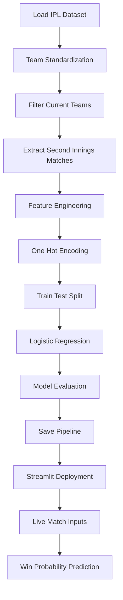

# 🏏 IPL Real-Time Match Prediction using Machine Learning

### Predicting IPL Chase Outcomes Ball-by-Ball using Machine Learning

---

## 📌 Overview

The **IPL Real-Time Match Prediction System** is a machine learning-powered application designed to estimate the winning probability of a team chasing in the second innings of an IPL match.

Built using **Logistic Regression**, **Scikit-Learn Pipelines**, and **Streamlit**, the project processes historical IPL ball-by-ball data to generate dynamic win probabilities based on the current match situation.

By considering factors such as runs required, balls remaining, wickets in hand, venue conditions, and run rates, the system simulates the type of probability engines commonly used in modern cricket analytics platforms.

---

## ✨ Key Highlights

* 🏏 **Ball-by-Ball IPL Dataset Analysis**
* 📊 **283,000+ Deliveries Processed**
* 🧹 Team Name Standardization & Data Cleaning
* 🎯 Logistic Regression Probability Model
* ⚡ Interactive Streamlit Dashboard
* 🧠 Scikit-Learn Pipeline Integration
* 📈 Real-Time Win Probability Estimation
* 🌍 Venue-Aware Predictions
* 💾 Serialized Model Deployment using Pickle
* 🚀 ~80.4% Prediction Accuracy

---

## 📊 Dataset Summary

| Property            | Details                   |
| ------------------- | ------------------------- |
| Raw Deliveries      | 283,678                   |
| Filtered Deliveries | 114,581                   |
| Seasons Covered     | 2008 – 2026               |
| Teams Included      | 10 Current IPL Franchises |
| Match Type          | Second Innings Chases     |
| Target Variable     | Match Won / Lost          |
| Missing Values      | Removed                   |
| Encoding Method     | One-Hot Encoding          |

---

## 🏟️ Features Used by the Model

| Feature           | Description           |
| ----------------- | --------------------- |
| Batting Team      | Chasing Team          |
| Bowling Team      | Defending Team        |
| City              | Match Venue           |
| Runs Remaining    | Runs Needed to Win    |
| Balls Remaining   | Deliveries Left       |
| Wickets Remaining | Available Wickets     |
| Current Run Rate  | Current Scoring Rate  |
| Required Run Rate | Required Scoring Rate |

---

## 🤖 Machine Learning Pipeline

---

## 📈 Model Performance

| Metric           | Score               |
| ---------------- | ------------------- |
| Algorithm        | Logistic Regression |
| Test Accuracy    | **80.37%**          |
| Features Used    | **8**               |
| Training Samples | **91,664**          |
| Testing Samples  | **22,917**          |

The model demonstrates strong predictive capability for T20 chase scenarios and provides probability-based insights instead of simple binary classifications.

---

## 🖥️ Streamlit Dashboard Features

### Match Context Inputs

✔ Batting Team (Chasing)

✔ Bowling Team (Defending)

✔ Match Venue

✔ Target Score

✔ Current Score

✔ Overs Completed

✔ Wickets Lost

### Live Match Metrics

📌 Runs Required

📌 Balls Remaining

📌 Current Run Rate

📌 Required Run Rate

### Prediction Output

📈 Winning Probability %

📉 Losing Probability %

🏏 Real-Time Chase Projection

---

### 🏆 Bringing Data Science to Cricket Analytics

⭐ If you found this project interesting, consider giving it a star.

